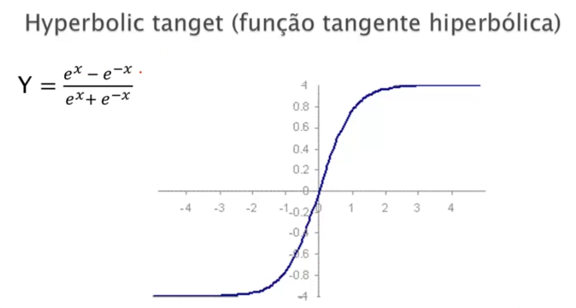

<h1 align="center">NEURAL NETWORK - PERCEPTRON</h1>

Made with: python with anaconda

  
  

  

  
  
  

<h2 align="center">Transfer (Activation) Functions</h2>

<h3 align='center'>Unit step (threshold)</h3>

  The output is set at one of two levels, depending on whether the total input is greater than or less than some threshold value.

  

<h3 align='center'>Sigmoid</h3>

  The sigmoid function consists of 2 functions, logistic and tangential. The values of logistic function range from 0 and 1 and -1 to +1 for tangential function.

  

<h3 align='center'>Hyperbolic tangent - (TanH)</h3>

  TanH (hyperbolic tangent) activation function and its derivative are defined by Eqs. (9.2) and (9.3), respectively TanH is a nonlinear activation function, with its center at 0 and its value ranging between –1 to 1 as shown in the graph in Fig. 9.4. It is mainly used in hidden layers, because its mean is 0 or near to it which helps in centering the data.[7] This eases the learning for the next layer.

  

